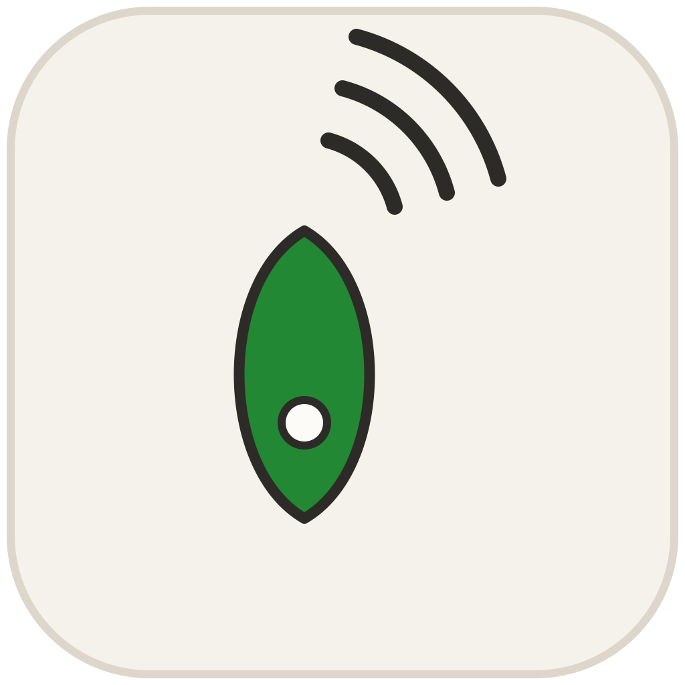

# RND Companion

Capture and send patch seeds on a [Cymaforma RND Synth](https://www.cymaforma.com/rnd-synth),
and keep a curated library of the ones worth remembering.

Part of the [Enkerli music suite](https://github.com/enkerli/music-suite). Public domain (Unlicense).

## Two transports, and why

Seeds only move over SysEx, so the project's first job was to find out whether
hosts pass it. They were measured, not guessed ([SYSEX_PASSTHROUGH.md](docs/SYSEX_PASSTHROUGH.md)):

**No host damages SysEx.** Every frame that reached a plugin arrived byte-exact.
What differs is routing — whether a host will carry a plugin's SysEx *out* to
hardware. AUM does, both ways. Logic and Bitwig would not, through the
sanctioned HW/External Instrument paths.

So the companion carries two transports:

- **Direct MIDI port** (default) — it opens the RND itself. Needs no host
  routing, works everywhere, and is the only thing that works in Logic and
  Bitwig.
- **Host MIDI stream** — the plugin's own MIDI in/out. Proven in AUM.

The host is still worth having for what hosts are good at: the note stream,
transport, and recording the device's sequences.

## Layout

```
Source/Protocol/    rnd_protocol — the codec. Plain C++17, no JUCE, no I/O.
Source/App/         Model, transports, seed library. No view.
Source/Plugin/      The shell: a WebView and the event contract behind it.
Source/Probe/       RndSysExProbe — the host SysEx diagnostic.
Tests/              Protocol tests, including a real hardware capture.
docs/PROTOCOL.md    What is known about the wire protocol, and how surely.
docs/SYSEX_PASSTHROUGH.md  Per-host SysEx results and how to reproduce them.
```

**The UI is not in this repo.** It lives in the monorepo at
`music-suite/apps/rnd-companion` and is bundled into the plugin at build time,
the way the suite's other five embedded apps are. That is deliberate: it used
to be a JUCE `LookAndFeel` re-implementing `components.css` by eye, and every
design pass cost a round of geometry and colour bugs. Now the shipping
stylesheet *is* the styling.

CMake finds the app as a sibling checkout, inside the monorepo, or via
`$MUSIC_SUITE`; override with `webui.local.cmake` (see the `.example`).

`rnd_protocol` is deliberately free of JUCE so the plugin shells and a possible
WASM build of the web UI can share it unchanged.

## Build

```bash
cmake -B build -DCMAKE_BUILD_TYPE=Release && cmake --build build -j8
```

Formats: AU, VST3, CLAP and Standalone on macOS; AUv3 and Standalone on iPadOS;
LV2, VST3, CLAP and Standalone on Linux. For the iPad:

```bash
cmake -B build-ios -G Xcode -DCMAKE_SYSTEM_NAME=iOS && cmake --build build-ios --target RndCompanion_AUv3 --config Release
```

JUCE is found in this order: an installed `JUCE` package, `$JUCE_PATH`,
`/Applications/JUCE`, then fetched from GitHub.

Tests need no JUCE at all:

```bash
cmake -B build -DRND_BUILD_APP=OFF && cmake --build build && ctest --test-dir build --output-on-failure
```

## Using it

Connect the RND over USB, press **Find RND** (it matches any port with "RND" in
the name; pick by hand if yours differs).

- **Seeds arrive on their own.** The device broadcasts its seed whenever it
  changes, silently. You do not need to poll.
- **Read device** asks for a full status dump. It costs a brief audible mute,
  which is why it is a button and not a timer.
- A full dump is when a seed's musical metadata is known, so that is when the
  library writes an entry without being asked. **Add to library** captures
  whatever is known right now.
- **Scale** and **Tonic** lock on the hardware and change what a seed produces.
  Only a power cycle clears it. The UI says so; believe it.
- **Reverb** applies to the analog stereo mix out only. The four USB stems stay
  dry, so audition it on headphones.

The library lives at `~/Library/Application Support/RND Companion/seed-library.json`
on macOS and exports to plain JSON.

## Icon



A die — the plainest word for what an RND is — with four ink pips and a fifth at
the centre in the suite's one unclaimed hue (`es-pc-2` green): the captured
seed. Bold filled geometry, so it holds together at favicon size, and it sits
structurally with `pickpcs` and `exquisite-fingerings`. Drawn by a Claude design
pass, 2026-08-11 (v2 — the first mark was thin and shapeless).

## The Shared Frame

The suite's global cluster, in its fixed order: **theme · MIDI · density ·
Library · build**. That order is the point — someone who learns where the theme
control lives in another suite app finds it in the same place here.

The web cluster has a `native: true` mode whose MIDI chip reads "MIDI · native"
because routing belongs to the host. This app owns its ports, so the same slot
does the job for real: the chip shows connection state and opens a panel with In
and Out plus Find RND and Rescan.

Density is a setting, not a redesign — Comfortable/Compact moves one number
(`--es-ctl-h`), which is what makes a small AUv3 pane usable. The Library slot
hides the whole seed column and shows its count. The build chip is the rightmost
and non-interactive: it answers "which build am I looking at?" and nothing else.

## The library

Seeds are stored as `enkerli-library-item` envelopes (the suite's LIBRARY_SPEC),
`kind: patch`, `format: rnd-seed`. That buys stable identity, provenance and
facets you can actually search — "dorian", not scale index 6 — and it means a
library saved here opens in the rest of the suite. Files written by the earlier
private format are migrated on load, once.

The captured root is recorded as `rootWhenCaptured`, not as a tonic: the device
reports the root it is playing at that moment, and it moves while a patch runs.
Recording it as a setting would be a claim the hardware never made.

## Look and feel

The suite's "paper & ink" language, taken from `@enkerli/ui` tokens
(`packages/ui/tokens/tokens.css` and `DESIGN.md` in the monorepo) rather than
re-picked here — warm cream paper, warm ink, a warm-dark counterpart, the Vane
radii, mono with tabular figures for anything numeric-musical.

Light is the default design target; dark is a first-class variant. The theme
control is the suite's single **toggle**, whose label names the mode you would
get — one tap, as everywhere else in the suite. It follows the OS until you tap
it; after that your choice is saved with the plugin state. Controls are 32px with a pointer and 44px on touch, so the same
layout works on a desktop and under a fingertip; the columns stack below 860px
for narrow AUv3 panes.

Ratings are never colour alone — each row carries a K/P letter beside its
colour bar.

Still to come from the suite: library Information Architecture, and the
Workspace component for modular work.

## Elsewhere in the suite

The wire codec has a TypeScript twin, `@enkerli/rnd` in the
[music-suite](https://github.com/Enkerli/music-suite) monorepo, checked against
the same vectors as the C++ here so the two cannot drift. It backs two more
surfaces:

- **`msuite rnd`** — headless. `seed`/`read`/`decode` build and read frames
  anywhere; `scan <capture.mid>` pulls every SysEx frame out of a MIDI recording
  and folds it into a status; `send`/`watch` drive an ALSA rawmidi device on
  Linux.
- **A Workspace module** — watches for seed changes over Web MIDI and publishes
  them on the suite bus, so a knob turn on the hardware can drive anything else
  on the control plane.

If you change the protocol here, change `packages/rnd/vectors/frames.json`
there, and vice versa.

## Recording the four audio channels

Not a job for this plugin — the RND presents four USB audio inputs (pre-reverb,
one per instrument) plus the analog stereo mix, and your host records them.
What was found in practice:

- **Logic Pro** and **AUM** pick up all four inputs at once, clearly labelled,
  with no setup.
- **Bitwig Studio** needs an **aggregate audio device** (RND inputs plus your
  monitoring output). With that in place each channel is individually
  selectable and it behaves like the others.
- **Audio Hijack** works if you take the channels as two stereo pairs (1–2 and
  3–4) and split them afterwards.

Reverb applies to the analog mix only, so the four USB stems are always dry.

## What this does not do

It does not reimplement the device's patch generator, so it cannot predict what
a seed will sound like or search seed space offline. Every piece of musical
metadata comes from what the hardware actually reported. See the last section of
[docs/PROTOCOL.md](docs/PROTOCOL.md) for why.

## Roadmap

- [x] Protocol core with tests against a hardware capture
- [x] Capture, send, curate, live scale/tonic/volume/reverb
- [x] Per-host SysEx measurement (no host damages it; routing is the issue)
- [x] Plugin in every format, AUv3 included, with both transports
- [ ] Shared Frame + library IA + Workspace component (audit F2)
- [ ] Promote `affirm`/`caution` to suite tokens (audit F3 — monorepo decision)
- [ ] Controller channel routing
- [ ] MIDI clock toggle, once the tempo field is calibrated
- [ ] BIP39 three-word seed phrases, to match how Seed Lab writes them
